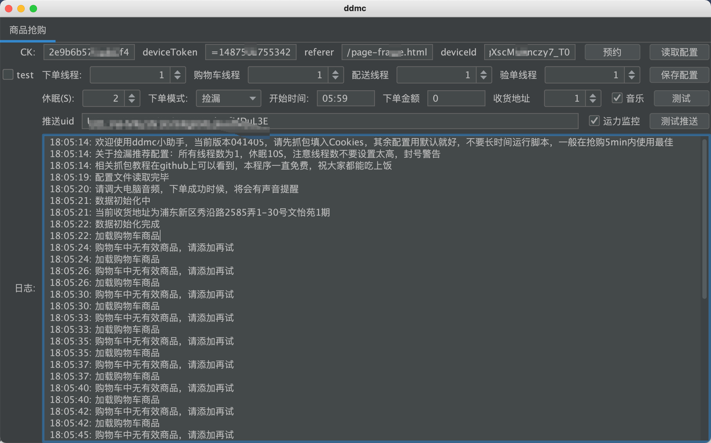
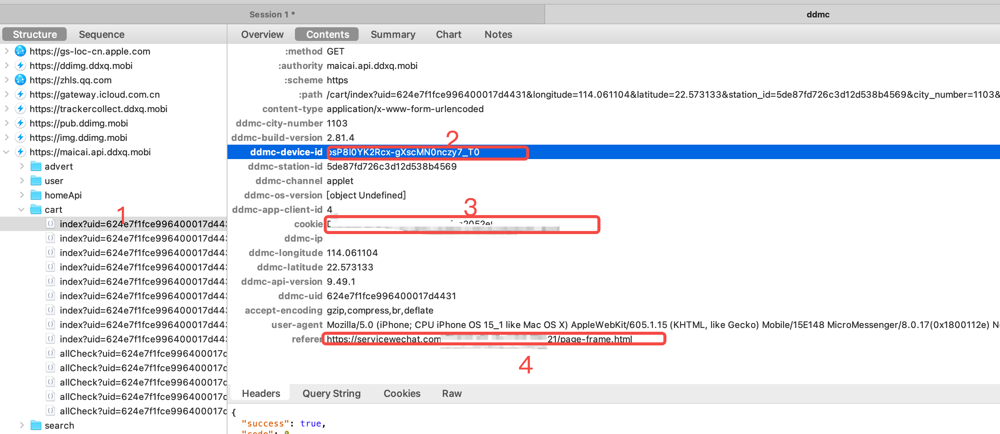
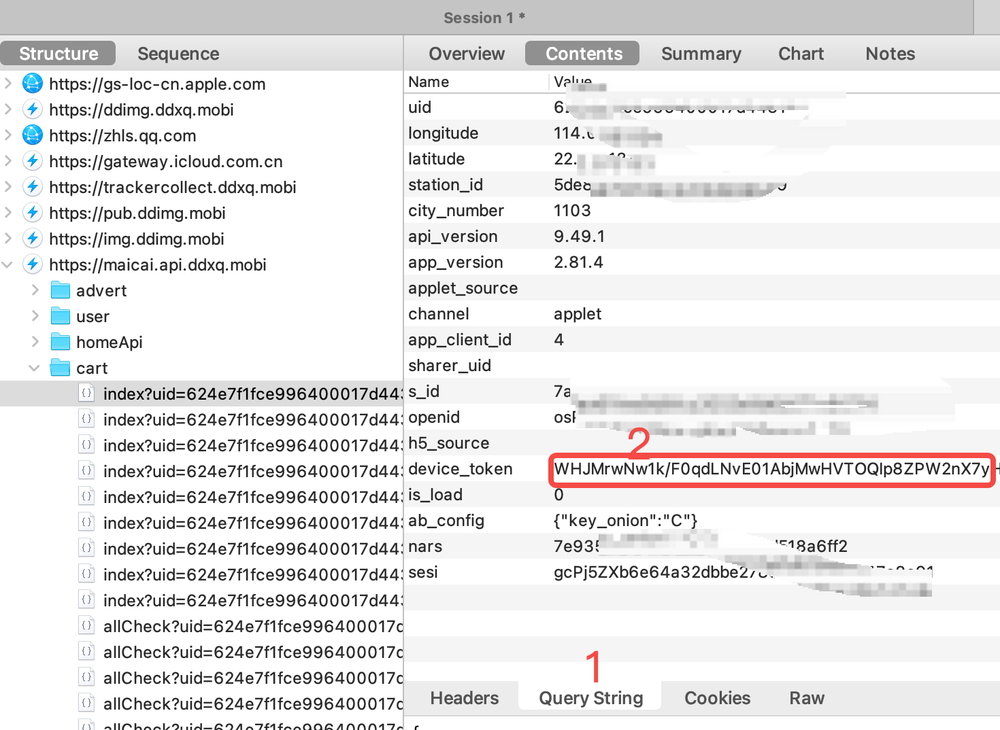

# 叮咚小程序自动预约
本程序为自动预约叮咚买菜小程序商品，为exe软件，无需配置代码环境，开箱即用
 

## 使用教程
1. 在release下载已经打包好的程序并打开, [下载](https://gitee.com/wenxiansen/ddmc-gui/tags)，也会在gitee上同步更新此仓库 https://gitee.com/wenxiansen/ddmc-gui
2. 选用Charles抓包填入参数
3. 执行即可

## 注意事项

1. 如果在6点和8点30（进APP看公告有写开放时间）没买到不要一直跑程序，长时间并发接口会被对方拉黑到IP黑名单中，接口返回405,一般一分钟内没预约到就建议关闭程序
2. 推送配置说明：
    1. 点击此链接关注公众号 https://wxpusher.zjiecode.com/wxuser/?type=1&id=20101#/follow
    2. 然后点击「我的」-「我的UID」查询到UID
    3. 填入uid到推送uid,点击测试
3. 关于各个按钮的说明
    - ck（必填）: 登录态，对应抓包header中的cookies
    - deviceToken（必填）: 抓包获取
    - referer（必填）: 抓包获取
    - devicesId（必填）: 抓包获取
    - 读取配置: 由于配置项越来越多，每次重新打开软件重新配置比较麻烦，选中一个叫config.dd的文件中读取出来
    - 保存配置: 由于配置项越来越多，请在程序跑通之后将配置保留在你的文件夹中
    - 下单线程: 捡漏设置1，抢购设置5-10
    - 购物车线程: 捡漏设置1，抢购设置3
    - 配送线程: 捡漏设置1，抢购设置3
    - 验单线程: 捡漏设置1，抢购设置3
    - 休眠（S）: 这个只对下单模式中的捡漏选项有用，推荐5S
    - 下单模式: 捡漏（非抢购时段有一定几率放库存和运力），直接预约（早6和早8.30分会有大量库存和运力，此时段改为直接预约，此功能非常容易封号，一般2-5分钟没成功改为捡漏模式）
    - 开始时间: 对应的直接预约功能，会卡住提交订单时间到你所设置的时间，并不是定时跑功能
    - 下单金额: 当购物车中的商品金额大于下单金额才会下单，默认为0，也就是所有金额都可以下单
    - 收货地址：默认为第一个收货地址，可以按照顺序填写
    - 音乐: 成功后播放音乐，请调大电脑音频音量，也就是美好的一天即将从这里开始
    - 推送uid: 成功后有一个微信推送提醒你付款，在推送配置说明有详细的操作步骤，务必配置好和测试好，别错过一次吃饱的机会
    

## 快捷抓包

忘记小程序已经有PC版了，手机进入小程序右上角3个点->在电脑中打开即可，送上一个参考文章https://blog.csdn.net/z2181745/article/details/123002569 比手机抓包方便太多。

注意事项
1. Charles安装和配置好后再打开或重新打开电脑端叮咚小程序，如果在之前打开可能会抓不到
2. 如果使用电脑端小程序抓包，则不要去碰手机微信里的叮咚小程序，否则session会失效，反过来也一样，其他操作在app上操作不影响，但不能同时在两个端的小程序操作，互斥
3. exe中session、referer、device_id将从header中读取
exe中devices将从header中读取

## 版本
20220415014版本更新日志 
1. 优化下单

2022041404版本更新日志 
1. 增加wxpusher推送

2022041403版本更新日志 
1. 更新api版本号和捡漏逻辑, 请勿使用2022041402版本捡漏

[=2022041402版本更新日志=] 
1. 更改捡漏逻辑，捡漏请用此版本

2022041401版本更新日志 
1. 抢购成功增加音乐提醒，避免错误付款时间
2. 优化下单参数
3. 修复购物车无商品会校验订单
4. 增加最小订单金额下单逻辑，如果小于改下单金额，则不会下单
5. 新增收货地址选择，按照收货地址顺序填入，默认是第一个，但是目前测试会按照你定位的地址自动选择

2022041303版本更新日志
1. 捡漏模式加强，建议捡漏设置间隔时间为10S
2. 增加自动全选购物车所有商品

2022041302版本更新日志
1. 修复只有一个地址时的报错
2. 优化线程打印

 
 
有使用上的疑问可以加群咨询
 